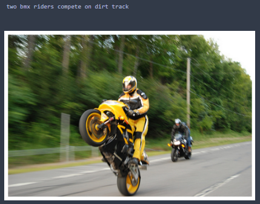
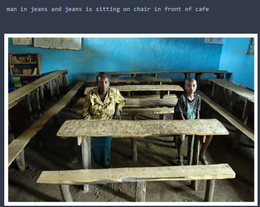
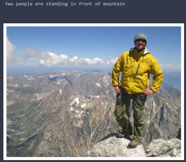
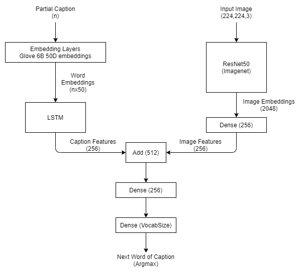

# Image Captioning Bot with Resnet50 Model (Flickr8k)
Implementation of 'merge' architecture for generating image caption from paper "What is the Role of Recurrent Neural Networks (RNNs) in an Image Caption Generator?" using Keras. Dataset used is Flickr8k available on Kaggle.

### Some sample captions that are generated
1       	  | 2		| 	3             
:-------------------------:|:-------------------------:|:------------------------:
  |  		|  

### Prerequisites
You will need Python 3.X.X with some packages. 
- keras
- tensorflow (as backend)
- numpy
- NLTK
- numpy
- pandas
- matplotlib
- scikit-learn
 
You can install above packages by the following command:
`pip install [package-name] --user`

### Get the Dataset
I have used flickr8k dataset that is available on kaggle. 
Link: https://www.kaggle.com/ming666/flicker8k-dataset

## Generating Image Caption
In neural image captioning systems, a recurrent neural network (RNN) is typically viewed as the primary ‘generation’ component. This view suggests that the image features should be ‘injected’ into the RNN. This is in fact the dominant view in the literature. Alternatively, the RNN can instead be viewed as only encoding the previously generated words. This view suggests that the RNN should only be used to encode linguistic features and that only the final representation should be ‘merged’ with the image features at a later stage. 

This architecture keeps the encoding of linguistic and perceptual features separate, merging them in a later multimodal layer, at which point predictions are made. In this type of model, the RNN is functioning primarily as an encoder of sequences of word embeddings, with the visual features merged with the linguistic features in a later, multimodal layer. This multimodal layer is the one that drives the generation process since the RNN never sees the image and hence would not be able to direct the generation process.

In this model, RNN is only used as language model. RNN is feeded the word embeddings of partial caption starting from special token 'startseq', the RNN then generate encoded representation of partial sequence. While CNN is feeded the image, which generate a image representation.
These two representation i.e. language feature and image feature are appended together and feeded into another Feed Forward neural network. This FNN will output a vector of size equal to size of vocabulary. Index of highest value in that vector represents the next word of caption which is combined with the partial caption and again process continues untill we get the 'endseq' token from FNN.

## Architecuture used in Notebook:
